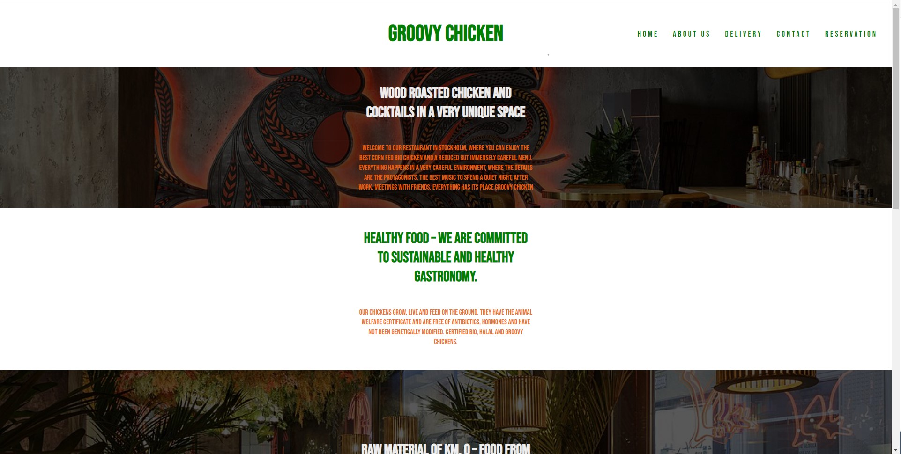
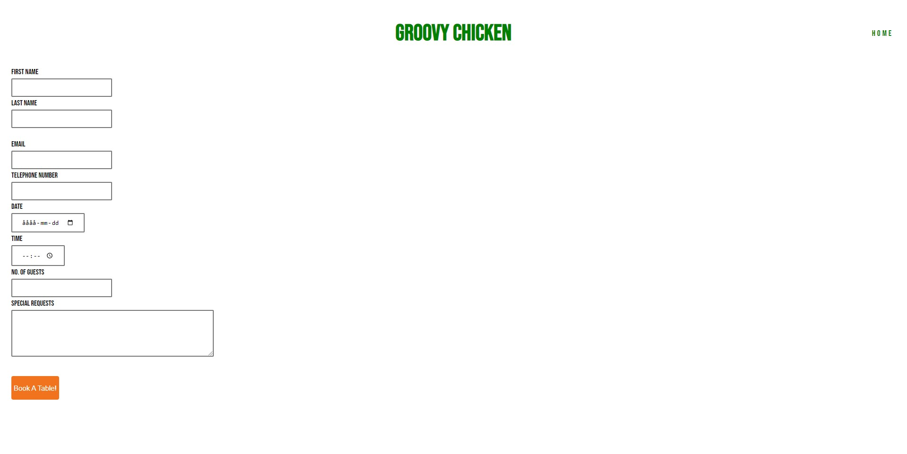
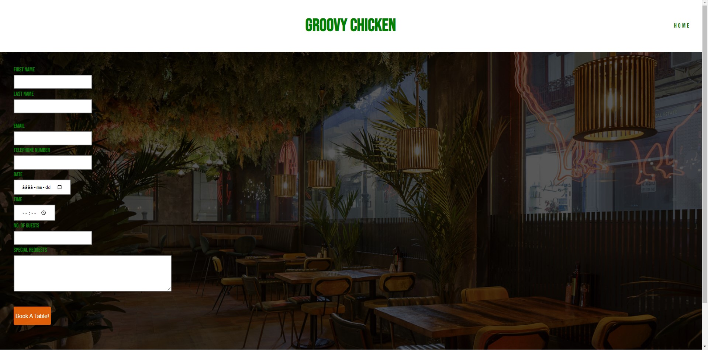

# groovy-chicken
Groovy Chickens README.

# <Groovy Chicken>

## Description

A web page about a restaurant that is located in sweden where you can reserve a table on and see what its about.

## Table of Contents (Optional)
  
- [Preview](#preview)
- [Credits](#credits)
- [Features](#features)
- [Testing](#testing)

## Preview 

    
    
    
    

## Credits
README.MD Template inspiration by nuxeo.com
codeinsitute.com
stackoverflow.com
w3schools.com

## Testing

HTML
No errors were returned when passing through the official W3C validator
CSS
No errors were found when passing through the official (Jigsaw) validator