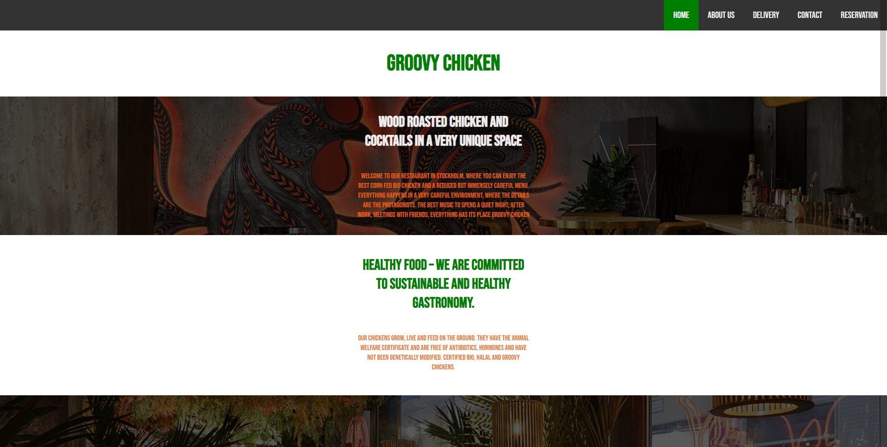
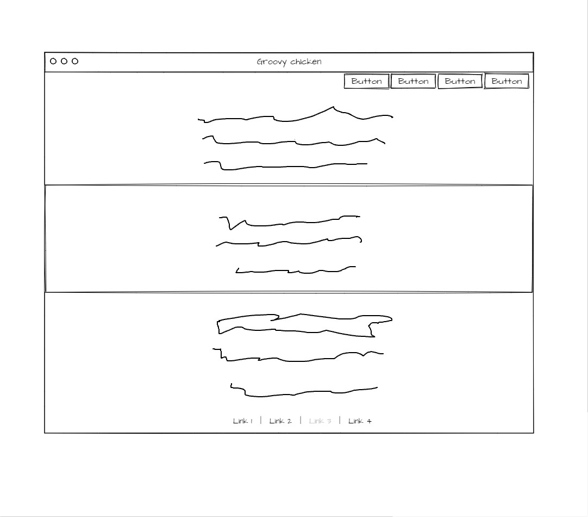
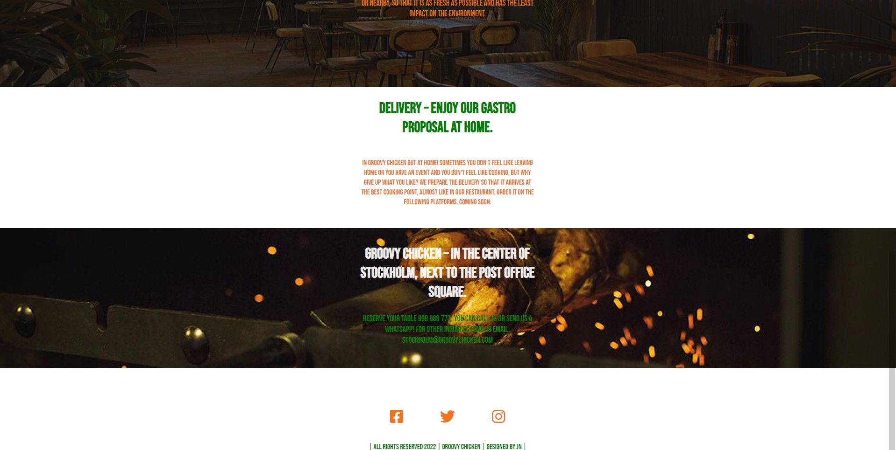
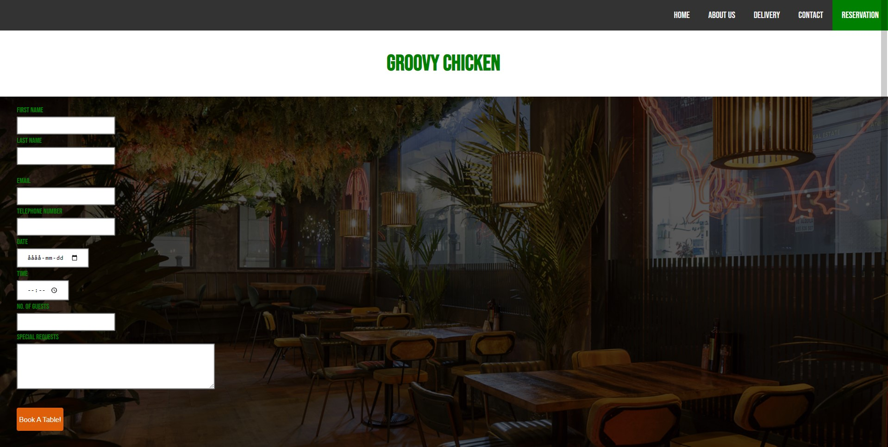
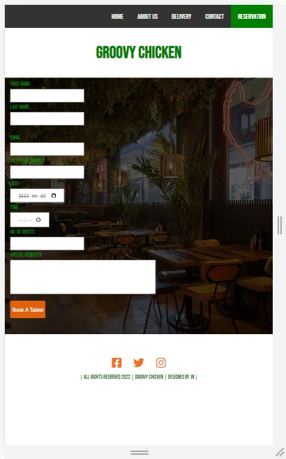
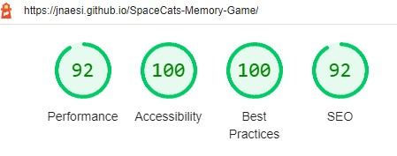

# Groovy-Chicken
## Introduction
Groovy Chicken is a website built for an restaurant in HTML and CSS. The page is about a restaurant that is located in sweden that only serves 100% "green" chicken where you can reserve a table on and see how the restaurant looks and what its all about. 

 </img>

## Table of Contents
* [Introduction](#Introduction)
* [The Skeleton Scope](#The-Skeleton-Scope)
    * [Wireframes](#Wireframe)
* [Features](#features)
* [Testing](#testing)
* [Deployment](#deployment)
* [Credits](#credits)
* [Media](#Media)
* [Acknowledgements](#Acknowledgements)

### Strategy Plane
* Groovy Chickens webpage is intended to be easy to navigate and quick to understand what its about. The graphical elements and overall design immediately provide the user with a visual indicator that sets the tone of the interaction.

#### Site Goals
* To provide users with a fun and simple layout 
* To ensure the site is fully accessible on desktop and touch enabled devices
* To ensure the site is fully compliant with keyboard commands and screen readers

### The Skeleton Scope
#### Wireframe mockups
I used Mockflow to produce wireframes of how the game would look across different devices.

#### Wireframe

# Features
* Common Features
The site is designed with a central layout that the HTML inserts the relevant CSS into.

* Future Features
There will be an form added where you can order food that has different delivery options.

#### Main Page
 </img>

#### Second Part Of Homepage
 </img>

#### Reservation form
 </img>

#### Mobile Device Preview

 </img>

## Testing

1: There was an issue with content overflow on reservation page. [Fixed]

#### Validator Testing
* HTML
  * No errors were returned when passing through the official W3C Validator.

* CSS
  * No errors were returned when passing through the official W3C CSS Validation Service - Jigsaw. 

* Lighthouse 
  * The lighthouse report gave a great score of 92, 100, 100, 92. 
  
  

#### Notable Bugs
No notable bugs during testing.

## Deployment

* The site was deployed to GitHub pages. The steps to deploy are as follows:
  * In the GitHub repository, navigate to the settings tab
  * Select the pages link from the setting menu on the left hand side 
  * Under the GitHub Pages from the source section drop-down menu, select the master branch 
  * One the master branch has been selected, the page will be automatically refreshed with a detailed ribbon display to indicate the successful deployment. 
  

## Credits

1. README.MD inspiration by nuxeo.com
2. codeinsitute.com
3. stackoverflow.com
4. w3schools.com

### Reference Material
The sites below where used as reference point for HTML/CSS
* https://stackoverflow.com/
* https://www.w3schools.com/

### Wireframe
* MockFlow - https://www.mockflow.com

### Media
The background image and the images of the cats was obtained from https://elements.envato.com/ a stock images site.

### Acknowledgements
I'd like to thank the students and community on slack that helped me through Javascript and the incredible learning materials on code institute.
